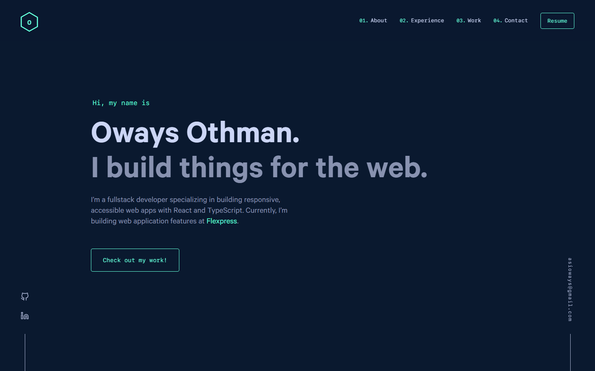
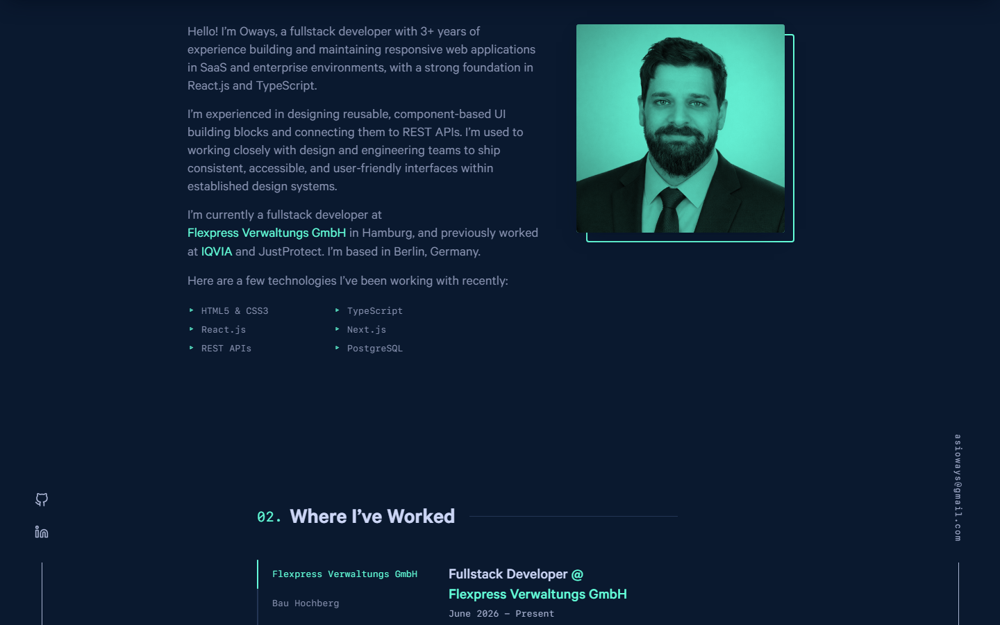
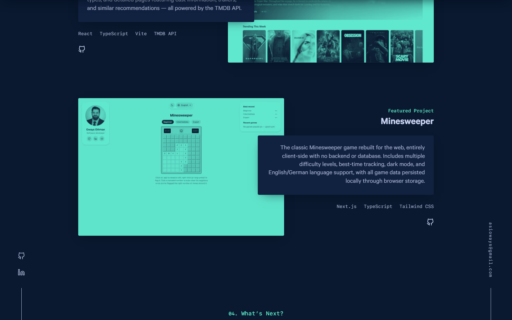

<div align="center">
  
</div>
<h1 align="center">
  Oways Othman — Portfolio
</h1>

## Screenshots

**Hero**



**About & Experience**



**Featured Projects**



## About this site

A single-page portfolio introducing me, my work experience and education,
and a showcase of projects I've built:

- **Hero** — quick intro and current role
- **About** — bio, skills, and headshot
- **Experience** — tabbed work history (Flexpress, Bau Hochberg, IQVIA, JustProtect)
- **Featured Projects** — [Convo](https://github.com/owaysasi/convo),
  [Cinemap](https://github.com/owaysasi/cinemap),
  [Compasso](https://github.com/owaysasi/compasso), and
  [Minesweeper](https://github.com/owaysasi/minesweeper-next), each with a
  screenshot, description, tech tags, and link to its repo
- **Contact** — a mailto link and social links (GitHub, LinkedIn)
- A downloadable **resume** (PDF), generated from an editable HTML source

## File structure

```
content/
  featured/        Featured project entries (one folder per project)
    Convo/index.md
    Cinemap/index.md
    Minesweeper/index.md
  jobs/             Work experience entries (one folder per job)
  projects/         "Other projects" archive (currently unused/empty)
src/
  components/
    sections/       Hero, About, Jobs, Featured, Contact
    icons/           SVG icons, including the logo/loader "O" mark
  config.js          Site-wide config: email, social links, nav, colors
  images/            Headshot (me.jpg), logo, favicons
  pages/             Gatsby pages (index, 404)
resume/
  source.html        Editable resume source — edit this, then re-export to PDF
static/
  resume.pdf          The resume served at /resume.pdf
docs/
  screenshots/         Images used in this README
gatsby-config.js        Site metadata, plugins
gatsby-node.js           Webpack aliases (@components, @config, etc.)
```

All page content (bio, experience, skills, projects) is driven by
[`src/config.js`](src/config.js) and the markdown files under
[`content/`](content/) — edit those to update the site.

## Installation & Setup

This project uses [Yarn](https://yarnpkg.com/) — `npm install` produces a
broken dependency tree for this version of Gatsby (duplicate `graphql`
packages), so Yarn is required.

1. Install and use the correct Node version with [NVM](https://github.com/nvm-sh/nvm)

   ```sh
   nvm install
   ```

2. Install dependencies

   ```sh
   yarn
   ```

3. Start the development server

   ```sh
   yarn develop
   ```

## Building and Running for Production

```sh
yarn build
yarn serve
```

## Updating the resume

Edit [`resume/source.html`](resume/source.html), then re-export it to PDF
(for example with `npx playwright pdf resume/source.html static/resume.pdf`)
and it'll be served at `/resume.pdf`.

## Credit

This site is built on top of the [v4](https://github.com/bchiang7/v4)
template, designed and built by [Brittany Chiang](https://brittanychiang.com).
All content, copy, and images have been replaced with my own — the design
and original implementation are hers.

## Color Reference

| Color          | Hex                                                                |
| -------------- | ------------------------------------------------------------------ |
| Navy           |  `#0a192f` |
| Light Navy     |  `#112240` |
| Lightest Navy  |  `#233554` |
| Slate          |  `#8892b0` |
| Light Slate    |  `#a8b2d1` |
| Lightest Slate |  `#ccd6f6` |
| White          |  `#e6f1ff` |
| Green          |  `#64ffda` |
